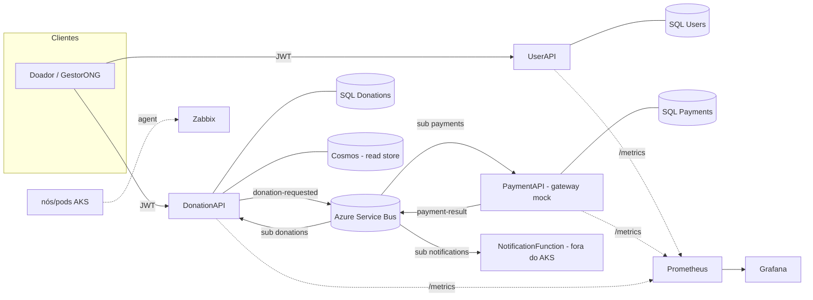

# hackaton-fiap-orchestration

Infraestrutura e orquestração do **Conexão Solidária** (Hackathon FIAP). Concentra os artefatos de
infra dos microsserviços: ambiente local (docker-compose), chart Helm para AKS e a stack de
observabilidade.

## Arquitetura / topologia



- **3 microsserviços** .NET 8 (UserAPI, PaymentAPI, DonationAPI) no **AKS**.
- **NotificationFunction**: Azure Function gerenciada, **fora do AKS** (deploy pelo próprio repo). Aqui aparece só no compose local.
- **Saga de 2 eventos** via Service Bus (`donation-requested` → `payment-result`), com DLQ e 3 tentativas.
- Decisões de produção em `Requisitos Técnicos` / `Requisitos Não Funcionais` (Obsidian); design em `docs/superpowers/specs/2026-06-18-orchestration-infra-design.md`.

## Estrutura

```
local/             Ambiente local completo (docker-compose + emuladores). Ver local/README.md
helm/conexao-service/   Chart Helm reutilizável p/ as 3 APIs + values por serviço
observability/     Prometheus (kube-prometheus-stack) + Grafana dashboards + Zabbix
k8s/               namespace.yaml (conexao-solidaria)
Makefile           Atalhos (up/down/logs/lint/template/deploy-*)
```

## Rodar localmente

A saga roda fim-a-fim com emuladores. Passo-a-passo detalhado em [`local/README.md`](local/README.md):

```bash
cd local
cp .env.example .env
docker compose up -d --build
```
APIs em `:5001` (users), `:5002` (payments), `:5003` (donations). Observabilidade local opcional:
`docker compose --profile observability up -d` (Prometheus `:9090`, Grafana `:3001` — 3000 é o front).

## Deploy no AKS (Helm)

Um chart reutilizável, um arquivo de values por serviço. Os segredos (`secrets:` no values ou via
Key Vault) **não** devem ser commitados com valores reais.

```bash
kubectl apply -f k8s/namespace.yaml

# Por serviço (ajuste image.registry e os secrets no deploy):
helm upgrade --install hackatonfiap-users helm/conexao-service \
  -f helm/conexao-service/values-users.yaml -n conexao-solidaria \
  --set image.registry=<acr>.azurecr.io --set image.tag=<sha> \
  --set-string secrets.ConnectionStrings__Default="<conn>" \
  --set-string secrets.Jwt__Key="<key>" --set-string secrets.Owner__Password="<pwd>"

helm upgrade --install hackatonfiap-payments helm/conexao-service \
  -f helm/conexao-service/values-payments.yaml -n conexao-solidaria --set image.registry=<acr>.azurecr.io
helm upgrade --install hackatonfiap-donations helm/conexao-service \
  -f helm/conexao-service/values-donations.yaml -n conexao-solidaria --set image.registry=<acr>.azurecr.io
```

**Azure Key Vault (CSI):** em vez de passar `secrets.*`, ligue `--set keyVault.enabled=true` +
`keyVault.name/clientID/tenantId` — o chart gera um `SecretProviderClass` e monta os segredos via CSI
(padrão recomendado, RNF21).

## Observabilidade

- **Prometheus + Grafana** (aplicação/negócio): `observability/prometheus/values.yaml` (kube-prometheus-stack) + dashboards em `observability/grafana/dashboards/`. Habilite o scrape por serviço com `--set metrics.serviceMonitor.enabled=true`.
- **Zabbix** (infra/host + disponibilidade + alertas): `observability/zabbix/` (manifests + README de config na UI).

## Mapeamento RNF → artefato

| RNF | Requisito | Onde |
|---|---|---|
| RNF05/06 | 1→2 réplicas + HPA CPU 70% | `helm` deployment.replicaCount + hpa.yaml |
| RNF10 | liveness `/health` + readiness `/ready` | `helm` deployment probes |
| RNF11/13 | DLQ + 3 tentativas | `local/servicebus/config.json` (emulador); Service Bus em prod |
| RNF21/39 | segredos via Secret/Key Vault + config externalizada | `helm` secret.yaml / secretproviderclass.yaml / configmap.yaml |
| RNF25/26 | `/metrics` + dashboards Grafana | `helm` servicemonitor + `observability/grafana` |
| RNF27/30 | infra/host + alertas (Zabbix) | `observability/zabbix` |
| RNF29 | métricas de fila/DLQ | dashboard (nota: via Azure Monitor) |
| RNF35/36 | containers + manifests K8s via Helm | `helm/conexao-service` |
| RNF38 | requests/limits por pod | `helm` values resources |

## Fora deste primeiro entregável (follow-up)

- Ingress NGINX + TLS (cert-manager) — RNF17.
- Azure APIM (rate limit / normalização) — RNF22.
- IaC dos recursos Azure (Bicep/Terraform: RG/AKS/ACR/Service Bus/Cosmos/Key Vault).
- Cert-bypass na DonationAPI para usar o emulador Cosmos local (hoje usa read store in-memory).
